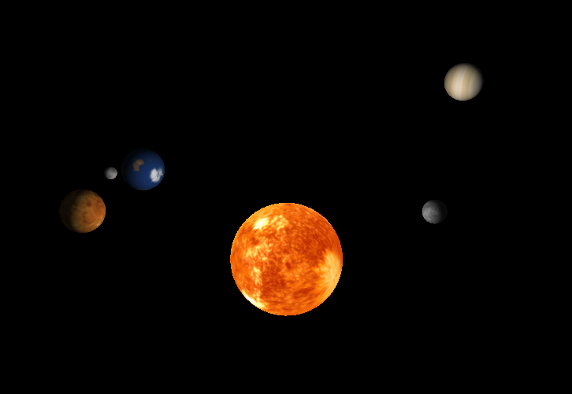

# Solar System 3D Model



<br>

---

## Overview
Semester Final Project for Computer Graphics. Goal was to make a vertex and fragment shader to simulate a semi-realistic solar system simulation. 

Project includes all the planets in our solar system (minus planet rings), the sun, and earth's moon. 

Future Improvements:
- Space themed background
- More accurate spacing of planets from sun
- Add planet rings
- Eliptical orbits instead of circular
- Improved camera functionality

<br>

---

## How to Run
1. Ensure all [libraries](#libraries-used) are properly installed
2. Open a terminal
3. Run the program:
``` bash
make run
```
4. To terminate program press ESC

<br>

---

## Libraries Used
- OpenGL
- GLUT
- GLU
- cmath
- stb_image


<br>

---

## References
[Solar Textures](https://www.solarsystemscope.com/textures/)

<br>

---

<br>

### Final Project for CSCI445 - Computer Graphics